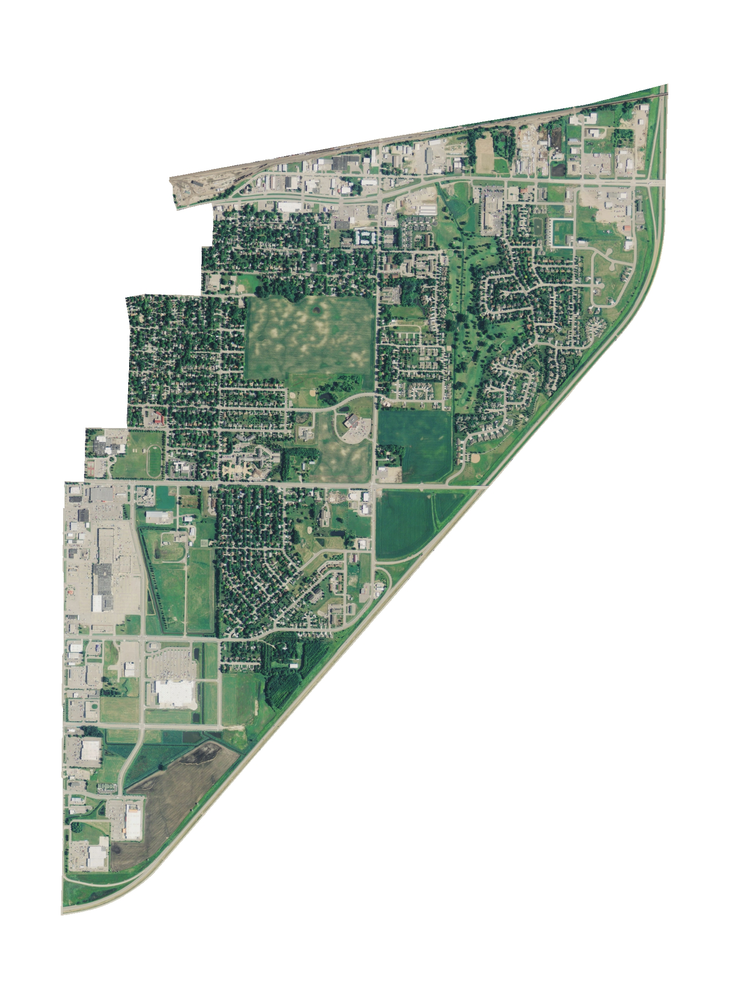
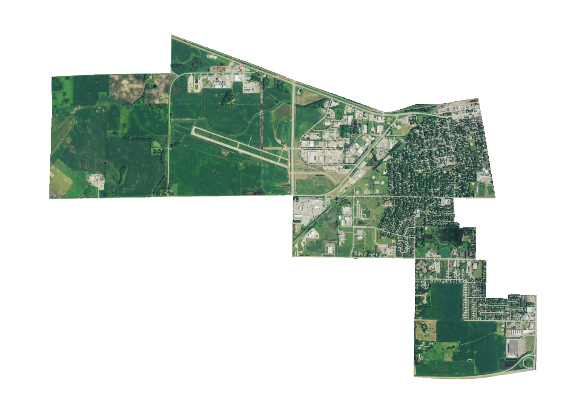
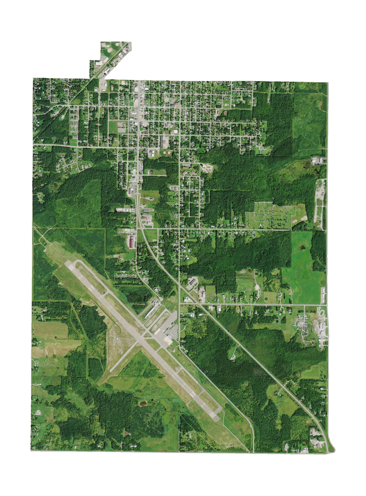
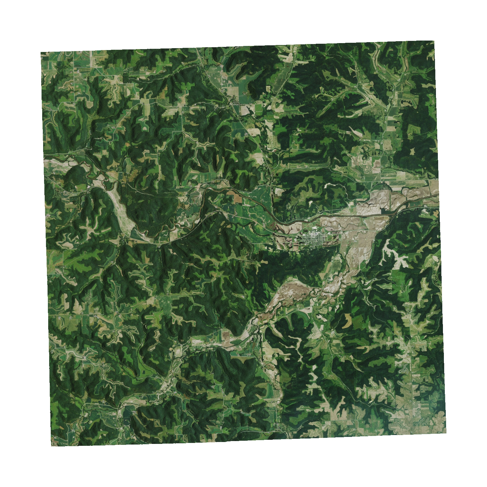
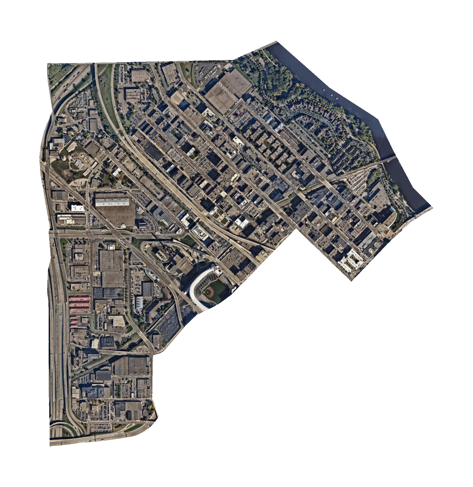

# Deep Convolutional Methods for Population Estimation

    
    
    
    
    

### Objective
This model estimates population statistics from satellite imagery of a region.

Population estimation based on aerial or satellite photography is a highly practical and well-studied computational task. According to Robinson et. al. [<a href=#1>1</a>], "knowing where people live is a fundamental component of many decision making processes such as urban development, infectious disease containment, evacuation planning, risk management, conservation planning, and more." However, the recent advances of deep neural networks have received limited use in population estimation, with only a handful of relevant papers [<a href=#1>1</a>,<a href=#2>2</a>,<a href=#3>3</a>]. This project expands on that work through two distinct contributions. First, it creates a novel dataset of 37,000 U.S. Census tracts. Second, it develops a deep convolutional model for population estimation trained on that dataset. The resulting model predicts the total population of a tract given its satellite image. Model quality is evaluated quantitatively through performance on an unseen test set of census tract images.

## References

[<a id=1>1</a>] Robinson, C., Hohman, F., & Dilkina, B. (2017, November). <a href="https://deeppop.github.io/resources/robinson2017-deeppop.pdf">A deep learning approach for population estimation from satellite imagery.</a> In Proceedings of the 1st ACM SIGSPATIAL Workshop on Geospatial Humanities (pp. 47-54).

[<a id=2>2</a>] Jacobs, N., Kraft, A., Rafique, M. U., & Sharma, R. D. (2018, November). <a href="https://arxiv.org/pdf/1810.09528.pdf">A weakly supervised approach for estimating spatial density functions from high-resolution satellite imagery.</a> In Proceedings of the 26th ACM SIGSPATIAL International Conference on Advances in Geographic Information Systems (pp. 33-42).

[<a id=3>3</a>] Doupe, P., Bruzelius, E., Faghmous, J., & Ruchman, S. G. (2016, November). Equitable development through deep learning: The case of sub-national population density estimation. In Proceedings of the 7th Annual Symposium on Computing for Development (pp. 1-10).
